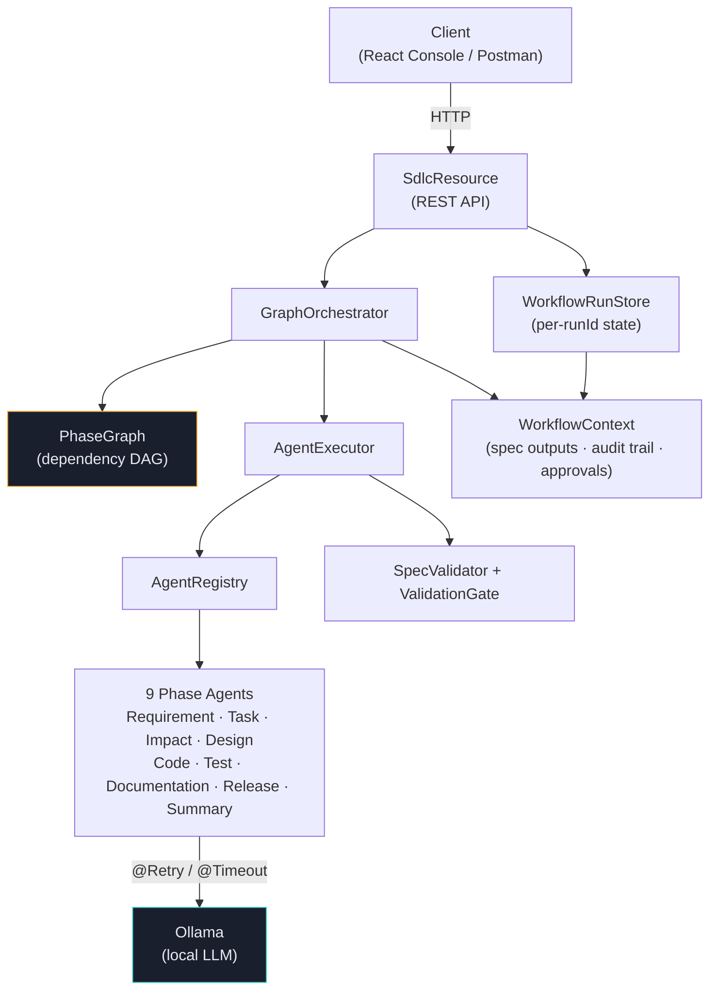
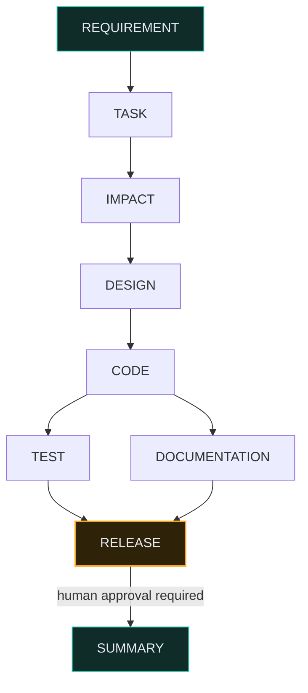
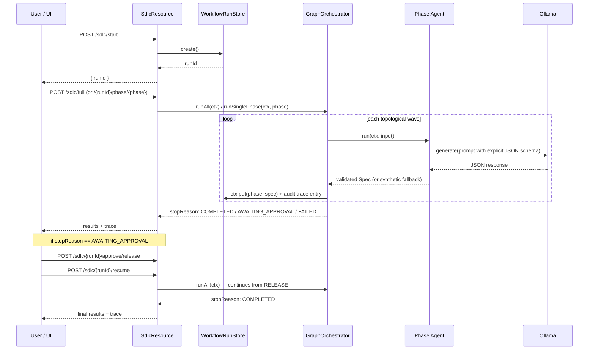

# Agentic SDLC Orchestration Engine

An agentic execution system that takes a natural-language requirement and drives it through a
governed, multi-phase software delivery lifecycle — requirement analysis, task decomposition,
impact analysis, design, implementation, testing, documentation, release, and summary — using
LLM-backed agents coordinated by an explicit dependency graph with human approval gates, bounded
retry, and audit-grade tracing. The URL shortener implementation this pipeline targets is
maintained as a separate artifact; this repository is the orchestration engine that produces it.

### Repository layout

```
agenticsdlc/
├── src/main/java/com/exam/agenticsdlc/   backend source (see component table below)
├── src/test/java/                        deterministic unit tests (§4)
├── ui/index.html                         web console - single-file React app (§2b)
├── postman/                              Postman collection covering the full API (§2c)
└── README.md
```

## 1. Architecture Overview

### Components



| Layer | Component | Responsibility |
|---|---|---|
| API | `SdlcResource` | REST entry points: start a run, execute phases, approve gates, inspect status |
| Orchestration | `GraphOrchestrator` | Walks the dependency graph in topological waves, enforces approval gates, runs independent phases concurrently, records the audit trail |
| Graph model | `PhaseGraph` | Declarative DAG of phase dependencies |
| Execution | `AgentExecutor` | Dispatches to the correct agent by type, runs post-execution validation |
| Governance | `SpecValidator` / `ValidationGate` | Hard-fails malformed/empty non-synthetic agent output; warns on synthetic/backfilled data |
| Resilience | `@Retry` / `@Timeout` (SmallRye Fault Tolerance) on every agent | Bounded retry + timeout around LLM calls |
| Normalization | `FlexibleStringListDeserializer` | Accepts LLM output that over- or under-structures a field (e.g. an object where a string array was requested) and normalizes it, rather than hard-failing on shape mismatches |
| CORS | `ManualCorsFilter` | Adds CORS headers directly via a JAX-RS filter for reliable behavior with the browser-based UI |
| State | `WorkflowContext` / `WorkflowRunStore` | Per-run state (phase outputs, audit trail, approvals), keyed by `runId`, persisted server-side across HTTP calls |
| Continuity | `SpecBackfillEngine` / `SpecBackfillRegistry` | Synthesizes a placeholder input spec when a phase is invoked without its upstream output present, so a phase can still run standalone |
| Agents | `RequirementAgent`, `TaskDecompositionAgent`, `ImpactAnalysisAgent`, `DesignAgent`, `CodeAgent`, `TestAgent`, `DocumentationAgent`, `ReleaseAgent`, `SummaryAgent` | One per SDLC phase; each prompts a local Ollama model with an explicit JSON schema and parses/validates the response into a typed `*Spec` |

### Orchestration model: explicit dependency graph

`PhaseGraph` declares real dependencies between phases as data, not as an implicit enum-iteration
order:



This is a genuine fork/join DAG: `TEST` and `DOCUMENTATION` both depend only on `CODE`, not on
each other, so `GraphOrchestrator` dispatches them concurrently within the same topological wave
and joins before proceeding. `RELEASE` is a join point requiring *both* to complete, and is
additionally flagged as a human-approval gate — it will not execute until an explicit approval is
recorded, regardless of whether its dependencies are satisfied.

### Control flow



1. `POST /sdlc/start` creates a run and returns a `runId`. All further calls against that `runId`
   share one `WorkflowContext`, so calling phases individually is genuinely stateful — phase N+1
   sees phase N's real output, not a synthetic stand-in.
2. `POST /sdlc/full` (or `/{runId}/resume`) drives the whole graph via `GraphOrchestrator.runAll`:
   wave by wave, dispatching independent phases concurrently, and stopping safely the moment it
   hits a phase requiring human approval that hasn't been approved, or a phase that failed after
   retries — nothing downstream of a failure or an unapproved gate executes.
3. `POST /sdlc/{runId}/approve/{phase}` records human approval; `POST /sdlc/{runId}/resume`
   continues the run from where it stopped.
4. `POST /sdlc/{runId}/phase/{phase}` runs exactly one phase on demand, enforcing the same
   dependency + approval checks — returns HTTP 409 with an explanatory message if the phase is
   blocked or ungated.
5. `GET /sdlc/{runId}/status` returns the audit trail: per-phase status, timing, retry attempts,
   completed phases, and approvals — the basis for success-rate / MTTR / latency metrics.

### Key design decisions

- **Graph model composes existing components rather than replacing them.** `AgentRegistry`,
  `AgentExecutor`, and `SpecBackfillEngine` are unchanged; `GraphOrchestrator` sequences them
  according to `PhaseGraph`'s declared dependencies instead of a fixed enum order.
- **Fault tolerance lives on the agents themselves** (`@Retry` / `@Timeout` from SmallRye Fault
  Tolerance) rather than hand-rolled in the executor — idiomatic Quarkus, and keeps retry policy
  visible next to the LLM call it protects.
- **Every agent prompt states an explicit JSON schema** matching its target spec's real fields.
  Earlier iterations left this implicit ("respond with JSON"), which reliably produced structurally
  plausible but non-conforming output (e.g. an array of objects where an array of strings was
  expected). `FlexibleStringListDeserializer` provides a second line of defense, normalizing
  reasonable shape variations instead of hard-failing on them.
- **Parse failures degrade to a clearly-marked synthetic result** rather than crashing the phase
  or (worse) silently producing an invalid non-synthetic spec. The raw LLM output is preserved on
  the spec for inspection, and the failure is logged server-side with full detail.
- **Validation gate has real hard-failure conditions.** A non-synthetic spec that is empty or
  structurally broken (e.g. a `RequirementSpec` with no acceptance criteria, a `CodeSpec` with no
  files) is blocked rather than allowed to propagate; synthetic/backfilled specs are treated as a
  warning, not a hard failure, since they're an explicit degraded-mode signal already.
- **In-memory run store.** State lives in a `ConcurrentHashMap` keyed by `runId`; a persistent
  store (Postgres/Redis) is the natural next step for anything beyond local/demo use, noted below.

## 2. Setup Instructions

**Prerequisites**
- Java 17
- Maven (or the included `./mvnw`)
- [Ollama](https://ollama.com) running locally on the default port (`11434`)

**Pull the models this project expects** (see `ModelName`):
```bash
ollama pull llama3
ollama pull deepseek-coder-v2
ollama pull qwen2.5-coder
```

**Run in dev mode**
```bash
./mvnw quarkus:dev
```

**Quick smoke test**
```bash
curl -s -X POST http://localhost:8080/sdlc/start
# -> {"runId": "..."}

curl -s -X POST http://localhost:8080/sdlc/full \
  -H "Content-Type: text/plain" -d "Build a new login feature"
# -> stops at RELEASE with stopReason=AWAITING_APPROVAL

curl -s -X POST http://localhost:8080/sdlc/<runId>/approve/release
curl -s -X POST http://localhost:8080/sdlc/<runId>/resume
curl -s http://localhost:8080/sdlc/<runId>/status
```

**Serve the UI**
```bash
cd ui
python -m http.server 5500
```
Open `http://localhost:5500/index.html`. See §2b below for what it does and how to drive a run
from it.

**Import the Postman collection** — see §2c below.

## 2b. Web Console

`ui/index.html` is a single-file React application (React + ReactDOM loaded from CDN, no build
step, no npm install) that visualizes the phase dependency graph live and drives the API directly
from the browser.

**To launch:**
```bash
cd ui
python -m http.server 5500
```
Then open `http://localhost:5500/index.html`. (Serving it this way, rather than double-clicking
the file, avoids `file://` origin edge cases with the browser's CORS handling.) The backend
(`./mvnw quarkus:dev`) must already be running on `localhost:8080`.

**What it shows:**
- The dependency graph itself, laid out to match `PhaseGraph`'s actual shape — including the
  `CODE → {TEST, DOCUMENTATION} → RELEASE` fork/join — with each node colored by live status
  (pending, running, awaiting approval, done, failed), polled from `GET /{runId}/status` every 4
  seconds.
- A detail panel showing the actual JSON output of whichever phase is selected.
- An **Approve** control that appears directly on the `RELEASE` node once its dependencies are
  satisfied, calling `POST /{runId}/approve/release`.
- A live audit trail table (agent, status, attempt, duration) sourced from `ExecutionTraceEntry`.

**Basic flow:** enter a requirement → **Start Run** → click **Run Full Pipeline** (or click
individual nodes to run phases one at a time) → **Approve** on `RELEASE` when it lights up → the
run completes to `SUMMARY`.

If the API base URL differs from `http://localhost:8080` (e.g. a different port), it's editable
directly in the top bar — no rebuild needed.

## 2c. Postman Collection

`postman/Agentic-SDLC-Pipeline.postman_collection.json` covers every endpoint end to end, with
`pm.test()` assertions on each request so the whole thing can be run via Postman's **Run
Collection** for a pass/fail summary rather than manual inspection.

**To use:** Postman → **Import** → select the file. It defines a `baseUrl` collection variable
(defaults to `http://localhost:8080`) and a `runId` variable that's captured automatically by test
scripts on the `Start a Run` and `Full Run` requests, so requests chain without manually copying
IDs between them.

**What's included:**
- Requests `1`–`13`: the full phase-by-phase flow against a single run — start, each phase in
  dependency order, the `RELEASE` approval gate (expected `409` before approval, `200` after), and
  the final status/audit-trail check.
- **Full Run - Auto-execute Whole Graph**: exercises `/sdlc/full`, asserting it self-stops at
  `stopReason=AWAITING_APPROVAL` / `stoppedAt=RELEASE`.
- **Full Run - Approve then Resume**: approves and resumes that run, asserting it reaches
  `stopReason=COMPLETED`.
- Negative tests: an unknown `runId` returns `404`; a phase requested out of dependency order
  returns `409` with an explanatory message.

## 3. Three Scenarios

### Greenfield — new feature from a clear requirement

**Input:** `"Build a new login feature with email/password auth and a forgot-password flow"`

A full run completed end to end, exercising the fork/join graph and the approval gate exactly as
designed:

```
1:00:xx AM  REQUIREMENT completed
1:01:13 AM  TASK completed
1:01:23 AM  IMPACT completed
1:02:03 AM  DESIGN completed
1:03:15 AM  CODE completed
1:03:47 AM  TEST completed
1:04:10 AM  DOCUMENTATION completed
1:04:23 AM  RELEASE approved       <- human approval checkpoint
1:04:30 AM  RELEASE completed
1:04:42 AM  SUMMARY completed
```

Every phase completed as non-synthetic (real LLM-produced) output, with `TEST` and
`DOCUMENTATION` both descending from `CODE` and converging into `RELEASE`, which did not execute
until the explicit approval call was made — visible directly in the audit trail as a distinct
`approved` event preceding the phase's own `completed` event. `SummaryAgent`'s output was a
coherent narrative synthesis of the release phase, not fallback text.

### Brownfield — enhancement to an existing system

**Input:** `"Add rate limiting to the URL shortener's redirect endpoint to prevent abuse."`

This scenario exercises two things the greenfield run doesn't: `ImpactAnalysisAgent` reasoning
about an existing system rather than a blank slate, and non-linear phase invocation.

Calling a downstream phase before its dependencies exist in the run demonstrates the graph's
governance directly:
```bash
curl -s -X POST http://localhost:8080/sdlc/<runId>/phase/impact \
  -H "Content-Type: text/plain" -d "Add rate limiting to the redirect endpoint"
# -> HTTP 409: "Phase IMPACT is blocked - missing completed dependencies: [TASK]..."
```
Running `REQUIREMENT` and `TASK` first, then `IMPACT`, allows it through — `ImpactAnalysisSpec`'s
`impactedModules` / `impactedServices` / `impactedAPIs` fields describe what the model identifies
as affected by the change.

**Known limitation:** `ImpactAnalysisAgent` reasons from the LLM's general knowledge of the
described system rather than an actual file/module scan of the real URL-shortener codebase — it
is not grounded in static analysis. This is the highest-value next step for genuine brownfield
credibility and is called out explicitly rather than presented as more capable than it is.

### Ambiguous — underspecified requirement

**Input:** `"Make the service faster."`

This exercises the validation gate's hard-failure path directly. `RequirementAgent` is prompted to
surface ambiguity via `ambiguities` / `missingInfo` rather than silently pick one interpretation
(faster at what — redirect latency, analytics queries, cold start?). If the resulting
`acceptanceCriteria` comes back empty — a plausible outcome for a genuinely vague input —
`SpecValidator` hard-fails the phase rather than letting an unactionable requirement flow into
`TASK` and beyond:
```bash
curl -s -X POST http://localhost:8080/sdlc/<runId>/phase/requirement \
  -H "Content-Type: text/plain" -d "Make the service faster."
```
The gate's response makes the block explicit and names the reason, rather than silently
propagating a low-quality requirement downstream. This is the clearest demonstration of
"controlled autonomy" in the system: the agent does not get to unilaterally decide what "faster"
means and proceed — the gate forces either a retry with clarified input or an explicit human
decision.

## 4. Testing Approach

Automated tests focus on the deterministic, LLM-independent core, where correctness can be
asserted exactly rather than judged against a nondeterministic model response:

- `PhaseGraphTest` — verifies the DAG structure: topological ordering, the `TEST`/`DOCUMENTATION`
  fork lands in the same parallel-eligible wave, `RELEASE` requires both as a join, and the
  approval flag is scoped to the correct phase.
- `SpecValidatorTest` — proves the validation gate can actually block (a non-synthetic spec with
  no acceptance criteria fails; a synthetic/backfilled one only warns).
- `WorkflowRunStoreTest` — proves state persists across separate calls against the same `runId`.

```bash
./mvnw test
```

The agents themselves (`RequirementAgent`, `CodeAgent`, etc.) call a live local Ollama instance;
asserting on LLM output content directly would be flaky and isn't meaningful without a
deterministic model. These are exercised via the scenarios in §3 and by inspecting the audit trail
(`GET /sdlc/{runId}/status`) after a run.

## 5. Limitations & Trade-offs

- **In-memory run store.** `WorkflowRunStore` is a `ConcurrentHashMap`; runs are lost on restart.
  A production deployment needs a persistent store (Postgres/Redis) keyed by `runId`.
- **`ImpactAnalysisAgent` isn't grounded in a real codebase scan** — see §3 (Brownfield).
- **Retry policy is uniform** (`maxRetries=2`, 120s timeout) across all agents rather than tuned
  per phase/model; per-agent SLAs are straightforward future work.
- **Approval gating currently covers only `RELEASE`.** Extending `PhaseGraph`'s approval set to
  other high-impact phases (e.g. `CODE` for security-sensitive changes) is a one-line change.
- **Parallel execution uses a plain fixed thread pool**, not Quarkus's reactive primitives
  (Mutiny). Functionally correct for the fork/join shape here, but doesn't integrate with Vert.x's
  event loop or provide back-pressure the way a Mutiny-based join would.
- **No re-planning on upstream change.** If a `RequirementSpec` is regenerated after `DESIGN` has
  already run, nothing currently detects the staleness and invalidates downstream phases — the
  context would need a "dirty" flag propagated forward through the graph.
- **CORS is handled via a manual JAX-RS filter** rather than the Quarkus CORS extension, after the
  extension's configuration did not reliably take effect in local testing. The manual filter
  reflects back the request's `Origin` header, which is appropriate for local/demo use but should
  be replaced with an explicit allow-list before any non-local deployment.

## 6. Final Engineering Summary

**Plan/rationale:** Model the SDLC as an explicit, declarative dependency graph rather than an
imperative sequence, so governance behaviors (approval gates, parallel dispatch, safe-stop on
failure) fall out of walking that graph rather than being special-cased per phase. Compose the
existing agent/executor/backfill components under this graph rather than rewriting them.

**Artifacts:** `PhaseGraph` (dependency model), `GraphOrchestrator` (graph-driven executor),
`WorkflowRunStore` / `WorkflowContext` (persistent, keyed run state + audit trail), a strengthened
`SpecValidator` with real hard-failure conditions, `FlexibleStringListDeserializer` for LLM output
normalization, `@Retry` / `@Timeout` on all nine agents, schema-explicit prompts across all nine
agents, `ManualCorsFilter`, and the `SdlcResource` stateful REST API, plus a React console for
visualizing and driving runs.

**Risks/trade-offs/validation:** see §5. The core risks accepted knowingly are in-memory state and
a general-knowledge (non-codebase-grounded) impact analysis — both prototype-grade rather than
production-grade, and both stated explicitly rather than glossed over.

**Assumptions:** a local Ollama instance is available with the three models above pulled; single
JVM instance (no clustering/distributed run-store concerns); the URL shortener artifact this
pipeline targets is maintained separately and is out of scope for this repository.

**Limitations:** see §5.
